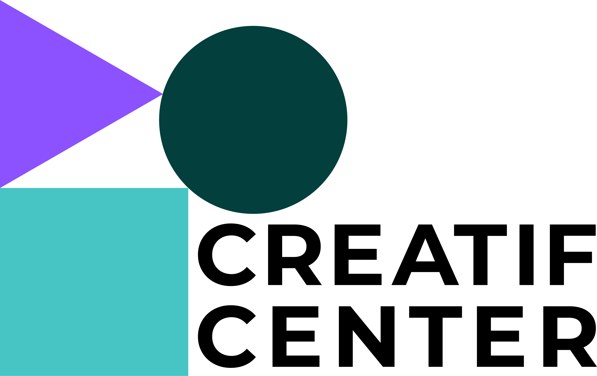

# AI in culture and arts - project workshop
{: .no_toc}

<!-- Insert large image -->

<!--  -->

<!-- <iframe width="560" height="315" src="https://www.youtube.com/embed/SVcsDDABEkM?si=JcI7kCw3WrDUQ8lj" title="YouTube video player" frameborder="0" allow="accelerometer; autoplay; clipboard-write; encrypted-media; gyroscope; picture-in-picture; web-share" allowfullscreen></iframe> -->

## 📰 Announcements
{: .no_toc }

<!--
12.12.2024 - **Next assignemnt for block 3 in january** : Prepare a new presentation of your project. It should be prepared as a rehearsal of your final presentation. Please explain your project's outcomes clearly, its dissemination plan (how are you going to communicate it outside of the class), and the relevance of your project for the cultural and artistic domains.

12.12.2024 - Refresh your mind about the [module description](/project-workshop/assets/pdf/module_introduction_aica2024.pdf) and [the project framework](/project-workshop/assets/pdf/project_framework_aica2024.pdf) we presented on the second day.

07.11.2024 - [Project planning spreasheet!](https://docs.google.com/spreadsheets/d/1BcliYrTlq2AoQn6ufqnvtvbGkdUGOhwhi3VsVmDeYrk/edit?gid=0#gid=0)

 -->
---

## Table of contents
{: .no_toc .text-delta }

1. TOC
{:toc}

---
## What is AICA? 

The Digitization College "Artificial Intelligence in Culture and Arts" (AICA) aims to equip students at the [University of Music and Performing Arts Munich](https://hmtm.de/) (HMTM) and [Hochschule München University of Applied Sciences](https://www.hm.edu/en/index.en.html) (HM) with necessary skills to impact AI innovations in the creative and cultural industries.

[Learn more about AICA](https://www.wavelab.io/aica/){: .btn target="_blank"}

## What is the project workshop ?

In the AICA Project Workshop, students from HMTM and HM will work in interdisciplinary teams to develop their own projects and ideas on the use of AI technologies in art, culture, and the creative industries. The course aims to equip students with the skills to actively shape AI-based processes in various artistic and creative fields, as well as to drive AI innovations in the cultural and creative industries.

At the beginning of the course (**starting on the 5th of November**), the teams will receive input from various experts on AI applications in music, film and media, visual arts, exhibition practices, and curating. The students will then engage in the creative processes of idea development and implementation.

The external experts Dr. Esther Fee Reinhardt (AI in music), Christoph Weber (film & media), Pauline Leininger (film & media), Max Haarich (visual arts), Maren Burghard (exhibition practices, curating), as well as experts from the AICA team (Mariya Dzhimova and Helena Held) will be present to accompany and support the projects. Furthermore Jule Schröder will support you in her role as agile coach.

You will develop **your own project** at the interface of AI in art and culture, spanning from an intelligent or interactive tool, an artistic performance, or anything in between that applies to the creative and cultural industries.

You will form **a team with students from HM and HMTM** with complementary expertise: computer science, data science, design, music, theater, or cultural management. 

In summary, you will **form a team** with students from HM and HMTM and **develop your own project** accompanied **on site** by technology and culture experts, and coached with [Agile software development](https://en.wikipedia.org/wiki/Agile_software_development) practices.

[Module presentation](/project-workshop/assets/pdf/module_introduction_aica2025.pdf){: .btn target="_blank"}

## What is artificial intelligence?

[Introduction to AI and ML](/project-workshop/assets/pdf/introduction_to_AI_2025.pdf){: .btn target="_blank"}

Designed for a non-technical audience in the arts and cultural sector, this presentation introduces what intelligence means in humans and machines, when and how learning becomes possible, and how computers actually learn from data. We will explore the principles behind modern AI---from neurons and learning algorithms to training models---and discuss how humans can shape, guide, and interact with learning systems. By the end, participants will hopefully have a grounded intuition of AI concepts and feel better equipped to engage creatively and critically with intelligent technologies.

## What is a good project?

[Framework and guidelines](/project-workshop/assets/pdf/project_framework_aica2025.pdf){: .btn target="_blank"}

[Assignment List](https://docs.google.com/spreadsheets/d/1SLIMYA2oABZvTsI7cWIwiWt1wehED3mX/edit?usp=drive_link&ouid=102588962245347726890&rtpof=true&sd=true){: .btn target="_blank"}

## Provisional schedule

Block 1:

- 5th of November 2025 at the Wavela, 10 am until 4 pm (Barerstraße 19, 80333 München)
- 6th of November 2025 at the Wavela, 10 am until 4 pm (Barerstraße 19, 80333 München)

Block 2:

- 3rd of December 2025 at the Wavelab, 10 am until 4 pm (Barerstraße 19, 80333 München)
- 4th of December 2025 at the Wavelab, 10 am until 4 pm (Barerstraße 19, 80333 München)

Block 3:

- 7th of January 2026 at the Wavelab, 10 am until 4 pm (Barerstraße 19, 80333 München)
- 8th of January 2026 at the Wavelab, 10 am until 4 pm (Barerstraße 19, 80333 München)

Final event:

- 12th of February 2026  at the Wavelab, 1:00 pm until 4:30 pm (Barerstraße 19, 80333 München)

## Evaluation and ECTS

You will earn **6 ECTS** for the validation of the course.
**Attendance** counts as an examination achievement and the teams will give a joint presentation on the projects they have developed at the end. There is also the opportunity to expand projects as part of a Bachelor's/Master's thesis and---who knows---maybe there will be a spin-off or two.
If you have an idea that you would like to implement, you are of course welcome to bring it to the course.

<!-- The following was Téo's plan which was good but I don't know if we can manage that again. -->

<!-- 
The evaluation will be based on 100 points, distributed as follows:
- 30 points for the careful completion of the assignements between blocks;
- 20 points for the final presentation, on the 30th of January 2025: oral presence, slides quality, and clarity of the outcomes and dissemination;
- 20 points for significance of the project outcomes and their potential impact on the cultural and artistic domains;
- 20 points for the relevance and significiance of the project's dissemination;
- 10 points for dedication and attitude: attendance, proactivity, team spirit, and respect. Additional penalties may be applied in case of deliberate misconduct that would harm the team or the course.

The 100 points will then be converted to the German grading system according to the table below:

| Points     | German system | Description                |
|------------|---------------|----------------------------|
| 90 - 100   | 1.0           | Very good (Sehr gut)        |
| 85 - 89    | 1.3           | Very good (Sehr gut)        |
| 80 - 84    | 1.7           | Good (Gut)                 |
| 75 - 79    | 2.0           | Good (Gut)                 |
| 70 - 74    | 2.3           | Satisfactory (Befriedigend) |
| 65 - 69    | 2.7           | Satisfactory (Befriedigend) |
| 60 - 64    | 3.0           | Satisfactory (Befriedigend) |
| 55 - 59    | 3.3           | Sufficient (Ausreichend)    |
| 50 - 54    | 3.7           | Sufficient (Ausreichend)    |
| Below 50   | 5.0           | Fail (Nicht ausreichend)    |

We encourage students to extend and capitalize on their projects to derive a bachelor or master thesis.
-->

## Where can I work with my team outside of the course days?

It is possible to benefit the infrastructure and tools of the [Creatif Center](https://hff-muc.de/de_DE/creatif-center-home) from the the [Hochschule für Fernsehen und Film](https://hff-muc.de) München. We will communicate you the access details during the course.

## Tools and tutorials

Many **open-source tools and libraries** developed by talented researchers and developers will help you implement your project without re-inventing the wheel. 
Discover all of them in section [Tools](/content/tools){: target="_blank"}.

Please also check the [relevant tutorials from our last tech crash course on human-AI interaction](https://aica-wavelab.github.io/tech-crash-course/docs/tutorials).

## License

The new teaching material created for the course is available under the [Attribution-NonCommercial-ShareAlike 4.0 International (CC BY-NC-SA 4.0)](https://creativecommons.org/licenses/by-nc-sa/4.0/).
**Each tool or library demonstrated in the tutorials is subject to its own license.**
