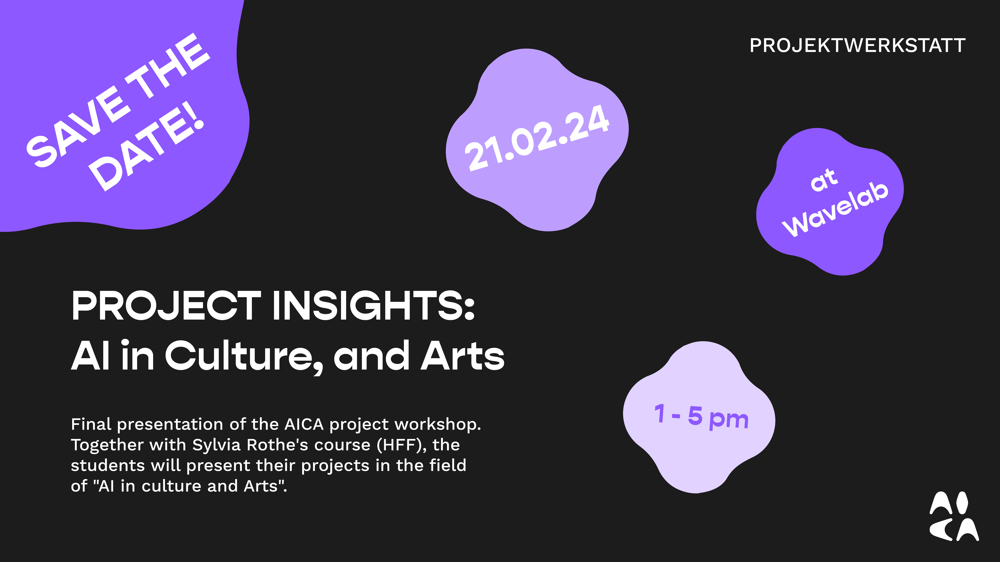

# AI in culture and arts - project workshop
{: .no_toc}

<!-- Insert large image -->

<!--  -->

<!-- <iframe width="560" height="315" src="https://www.youtube.com/embed/SVcsDDABEkM?si=JcI7kCw3WrDUQ8lj" title="YouTube video player" frameborder="0" allow="accelerometer; autoplay; clipboard-write; encrypted-media; gyroscope; picture-in-picture; web-share" allowfullscreen></iframe> -->

## 📰 Announcements
{: .no_toc }

02.09.2024 - The 2nd edition of the project workshop will be starting over in the Winter Semester 2024. Please enroll to the course in [Subscription](/content/subscription) section.

<!-- 11.01.2023 - Get ready! The third and last bloc of the course will take place on the 5th, 6th, and 7th of February 2024. You will be asked to demonstrate your MVP to our team of experts. -->

<!-- 11.01.2023 - 📹 Please [upload your minimal viable prototype (MVP) video](https://syncandshare.lrz.de/preparefilelink?folderID=2AJY8oqisdFWY5XY39rqv) before the 26th January 2024, 23:59. -->

<!-- 11.01.2024 - We watched your proof of concept videos! Congrats to all for your progress. Please find [our feedback](/content/feedback/poc_feedback) for the next phase. -->

<!-- 12.12.2023 - 📹 Don't forget to [upload your project's proof of concept video](https://syncandshare.lrz.de/preparefilelink?folderID=28Tg5PGQ2B1KQEbG4GCCD) before the 22nd of December, 23:59. -->

<!-- 11.12.2023 - Summary of the office hour meetings are available [here](/content/feedback/office_hours_summary). -->

<!-- 19.11.2023 - Visit of [Haus der Kunst](https://www.hausderkunst.de/) on Friday 24.11.2023 at 16:00. If interested to join, please fill [this form](https://forms.gle/zAiruR7BgL67Fzcv5). We'll meet on the steps of Haus der Kunst at 16:00 -->

<!-- 19.11.2023 - Test your knowledge on machine learning fundamentals with [this optional test](/assets/pdf/test_ml_fundamentals.pdf). A correction session will be organized during the 2nd or 3rd bloc. -->

<!-- 15.11.2023 - Personalized feedback for each group is available [here](/content/feedbacl/group_feedback). -->

<!-- 10.11.2023 - A complete list of tools is available in section [Tools and credits](/content/credits/). -->

<!-- 10.11.2023 - The presentation slides of the first bloc are [now available](https://syncandshare.lrz.de/getlink/fiByPXEJ9rS4yR42qToaSr/presentations_aica_2023.zip). -->

---

## Table of contents
{: .no_toc .text-delta }

1. TOC
{:toc}

---
## What is AICA? 

The Digitization College "Artificial Intelligence in Culture and Arts" (AICA) aims to equip students at the [University of Music and Performing Arts Munich](https://hmtm.de/) (HMTM) and [Hochschule München University of Applied Sciences](https://www.hm.edu/en/index.en.html) (HM) with necessary skills to impact AI innovations in the creative and cultural industries.

[Learn more about AICA](https://www.wavelab.io/aica/){: .btn target="_blank"}

## What is the project workshop ?

The AICA Project Workshop will be hosted at the Wavelab, in the Winter Semester 2024/2025 **starting early November 2024**.
This course will teach you how to build and apply AI and machine learning for the cultural and artistic domains.

You will develop **your own project** at the interface of AI in art and culture, spanning from an intelligent or interactive tool, an artistic performance, or anything in between that applies to the creative and cultural industries.

You will form **a team with students from HM and HMTM** with complementary expertise: computer science, data science, design, music, theater, or cultural management. 

You will be accompanied **on site** by technology and culture experts, and coached with [Agile software development](https://en.wikipedia.org/wiki/Agile_software_development) practices.

## Provisional schedule

Block 1:

- 6th of November 2024 at MUC.DAI  (Infanteriestraße 13, 80797 München, Room N.017)
- 7th of November 2024 at MUC.DAI  (Infanteriestraße 13, 80797 München, Room N.017)

Block 2:

- 11th of December 2024 at the Wavelab (Barerstraße 19, 80333 München)
- 12th of December 2024 at the Wavelab (Barerstraße 19, 80333 München)

Block 3:

- 8th of January 2025 at the Wavelab (Barerstraße 19, 80333 München)
- 9th of January 2025 at the Wavelab (Barerstraße 19, 80333 München)

Final event:

- 30th of January 2025 at MUC.DAI  (Infanteriestraße 13, 80797 München, Room N.017)

## Evaluation and ECTS

You will earn **6 ECTS** for the validation of the course.

The evaluation will be based on: **TO BE ANNOUNCED**

We encourage students to extend and capitalize on their projects to derive a bachelor or master thesis.

## Tools and tutorials

Many **open-source tools and libraries** developed by talented researchers and developers will help you implement your project without re-inventing the wheel. 
Discover all of them in section [Tools](/content/tools){: target="_blank"}.

Please also check the [relevant tutorials from our last tech crash course on human-AI interaction](https://aica-wavelab.github.io/tech-crash-course/docs/tutorials).

## License

The new teaching material created for the course is available under the [Attribution-NonCommercial-ShareAlike 4.0 International (CC BY-NC-SA 4.0)](https://creativecommons.org/licenses/by-nc-sa/4.0/).
**Each tool or library demonstrated in the tutorials is subject to its own license.**